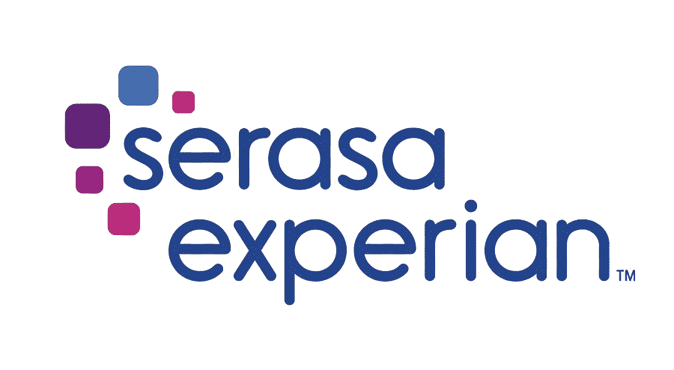
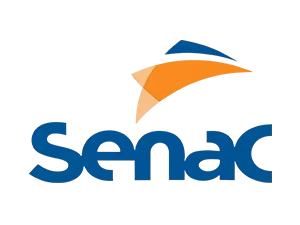
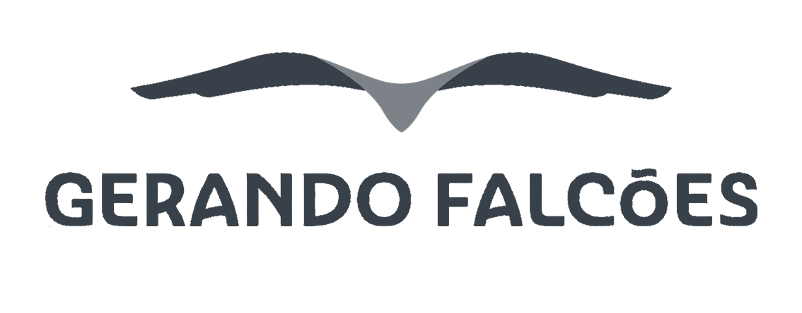

    
    
    
    

<h1>Lógica de Programação | Transforme-se</h1>
 

O curso de Lógica de Programação é um dos cursos oferecidos pelo programa **[Transforme-se](https://www.serasaexperian.com.br/transforme-se/)** promovido pela **Serasa Experian** em parceria com a **Gerando Falcões** e o **SENAC**.

 

> [!NOTE]
Esta iniciativa é direcionada a jovens entre 18 e 29 anos em situação de vulnerabilidade social, e tem como objetivo desenvolver e capacitar essas pessoas para ingressar na área de tecnologia, um setor amplamente conhecido por proporcionar excelentes oportunidades de emprego e crescimento profissional. 

 

Neste curso utilizamos o **Portugol** para entender os fundamentos da lógica de programação e construir algoritmos. 

 

    
    <h2>Portugol</h2>

 

É uma **linguagem de pseudocódigo** voltada para os iniciantes em programação que falam o idioma português. Possui uma sintaxe simples, mas que é bastante similar à sintaxe utilizada em muitas linguagens de programação, como C, C++, PHP e Java. 

E com ele é possível treinar diversos conceitos de lógica de programação, construir algoritmos complexos e até mesmo jogos.

 

**Opções de ambientes para programar em Portugol**

|  Desktop  |  Web | App |
| --------- | ---- | --- |
|  |  |  |

 

# Exercícios
Durante o curso realizamos diversos exercícios que você pode conferir clicando nos links abaixo. 

> Nos arquivos `README`, você encontrará uma breve demonstração de cada código executado no terminal.

> [!WARNING]
> Todos os códigos foram feitos por mim, então caso deseje utilizar dê os devidos créditos. 😉

 

| Nº    |  Conteúdo  | Pasta | README |
| ----  |  --------  | :--:  |  :--:  |
| 01    |  Representação de Algoritmos |  |  |
| 02    |  Introdução ao Portugol |  |  |
| 03    |  Tomada de Decisão |  |  |
| 04    |  Estruturas de Repetição  |  |  |
| 05    |  Vetores e Matrizes |  |  |
| 06    |  Subprogramas |  |  |
| 07    |  Mini Projeto |  |  |

 

#### Contribuições são bem-vindas! 🤗
#
Feito com 💜 por Bru
